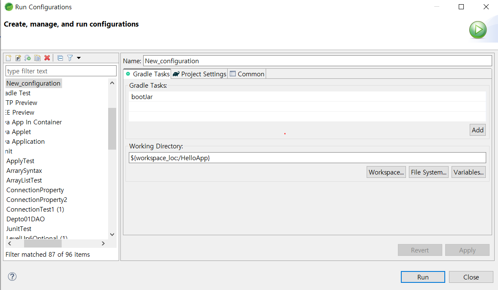
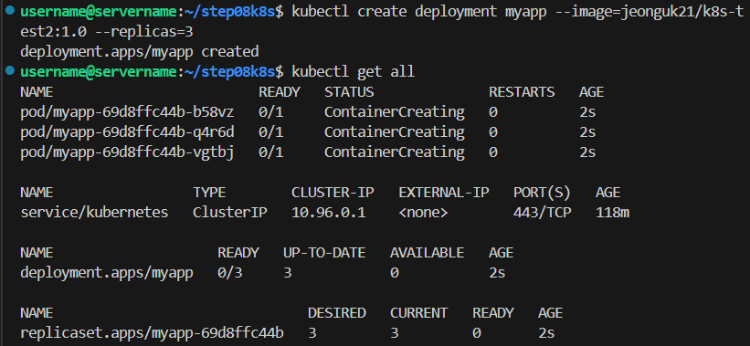
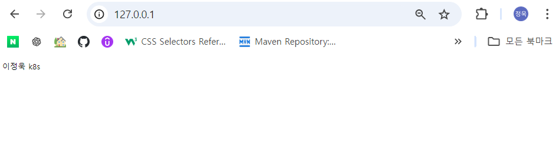
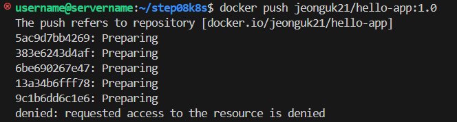
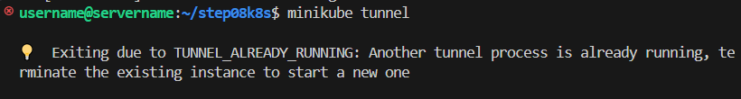
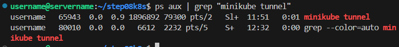
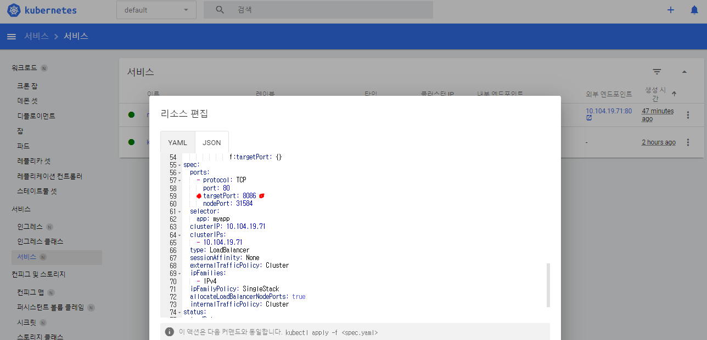

# 🚀 minikube-deployment

## 📦 목적
Docker Hub에 이미지를 업로드하고 Minikube에 배포

### 🛠️ Tech Stack
- Docker
- Kubernetes (Minikube)
- Docker Hub
- Spring Boot

---


### 1️⃣ Jar 파일 생성
배포할 애플리케이션의 Jar 파일을 생성합니다.



### 2️⃣ Docker Hub에 이미지 Push
생성한 이미지를 Docker Hub에 업로드합니다.


### 3️⃣ Deployment 생성
Kubernetes Deployment를 생성하여 애플리케이션을 Minikube에 배포합니다.



### 4️⃣ Service 생성
```bash
kubectl expose deployment myapp --type=LoadBalancer --port=80
```
Service를 생성하여 외부 트래픽이 애플리케이션으로 전달될 수 있도록 설정합니다.

### 5️⃣ Minikube Tunnel 및 포트 포워딩

```bash
minikube tunnel
```
Minikube 터널을 통해 외부에서 EXTERNAL-IP:80으로 접근할 수 있도록 포트 포워딩을 설정합니다.


### 6️⃣ 실행 및 확인
배포된 애플리케이션이 정상적으로 실행되고 있는지 확인합니다.



## 🛠️ Trouble Shooting

###  1. 기존 이미지 사용 시 CrashLoopBackOff 문제

이전에 생성된 이미지 파일을 사용하려 했으나, Deployment 생성 후 Pod의 상태가 **CrashLoopBackOff**가 발생했습니다. 이는 애플리케이션이 실행된 후 프로세스를 유지하지 않고 종료될 때 발생합니다.

>**해결 방법:** 애플리케이션을 다시 빌드하여 이미지를 새로 생성합니다.

### 2️⃣ Docker Hub에 이미지 Push 실패
Docker Hub에 로그인하였으나, 이미지가 업로드되지 않는 문제가 발생했습니다.



> **해결 방법:** 로그아웃 후 다시 로그인하여 문제를 해결했습니다.

### 3️⃣ Another tunnel process is already running 에러



Minikube 터널을 실행할 때, 기존의 터널 프로세스가 이미 실행 중인 오류가 발생했습니다.
```bash
ps aux | grep "minikube tunnel"
```


```bash
kill -9 65943
```

기존 터널 프로세스를 종료한 후 다시 실행하여 문제를 해결했습니다.


### 4️⃣ targetPort 설정 문제

Spring Boot 애플리케이션에서 `server.port`를 8086으로 설정했으나, Service의 `targetPort`가 80으로 설정되어 있어 문제가 발생했습니다.




> **해결 방법:** Kubernetes Dashboard에서 Service 리소스를 편집하여 `targetPort`를 8086으로 수정합니다.

